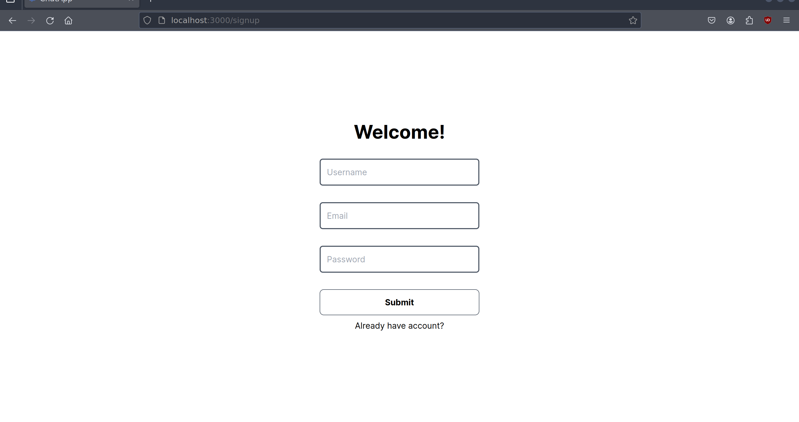
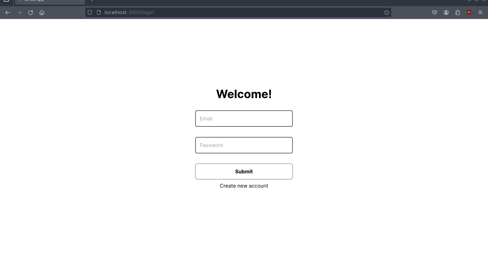
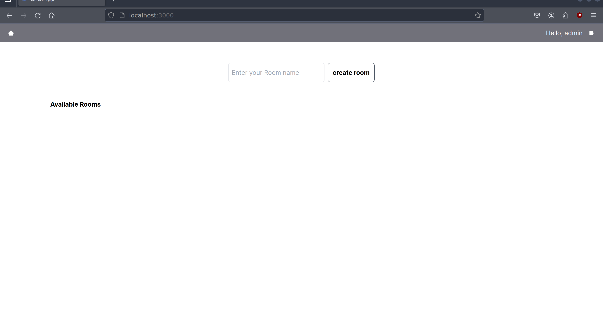
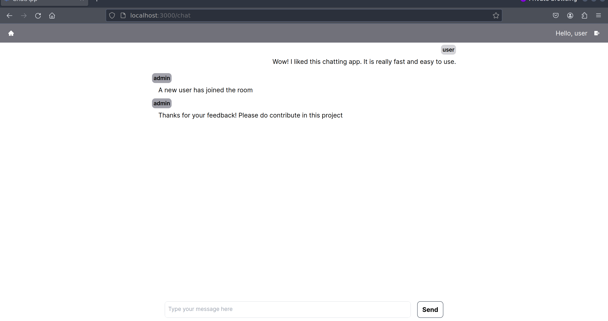

<h1 align="center">GoChatApp</h1>
<br/>

_GoChatApp is a modern and scalable real-time chat application that seamlessly integrates the power of Go for the backend, PostgreSQL for data storage, WebSocket for instant communication, and Next.js for the responsive and interactive frontend interface._

## Technologies used
* Typescript
* NextJS
* TailwindCSS
* Golang (Fiber)
* Postgres SQL
* Websocket
* Docker

## Running locally
First, clone the repo:

```git clone https://github.com/vickybesra/GoChatApp.git```

### Run Frontend
```bash
cd client

npm run dev
# or
yarn dev
# or
pnpm dev
# or
bun dev
```
Open [http://localhost:3000](http://localhost:3000) with your browser to see the result.

### Run Backend
GoChatApp requires [Golang](https://go.dev) and [Docker](https://docs.docker.com/get-docker) installed on your system.

Run postgres in docker and create db:

```sh
cd server
make postgresinit #start docker container running postgres
make createdb #create a db 
make migrateup #apply migration file to db
```

Install the dependencies and start the server:

```sh
cd server
go mod download #download dependencies
go mod tidy
go run cmd/main.go #start server
```
> Change .env file according to your preference.

## Screenshot
<p align="center"> SignUp Page</p>
<p align="center"> Login Page</p>
<p align="center"> Home Page</p>
<p align="center"> Chat Page</p>
